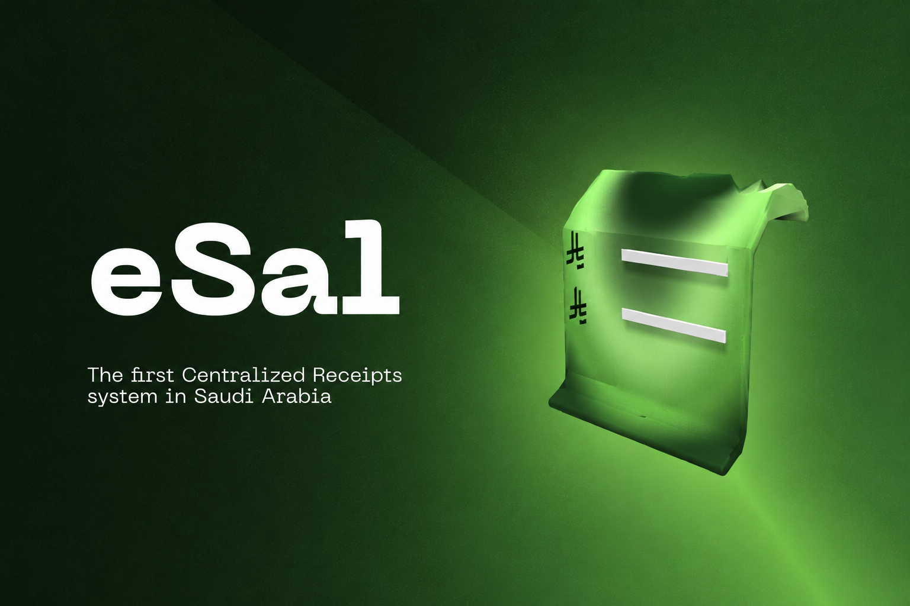
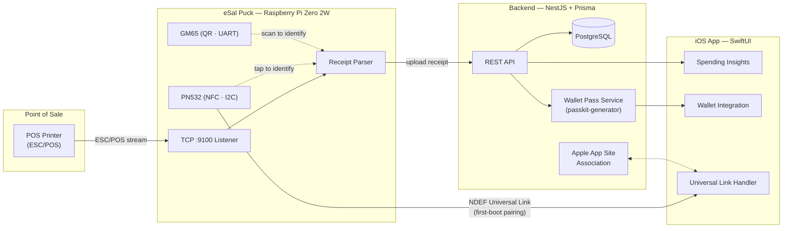
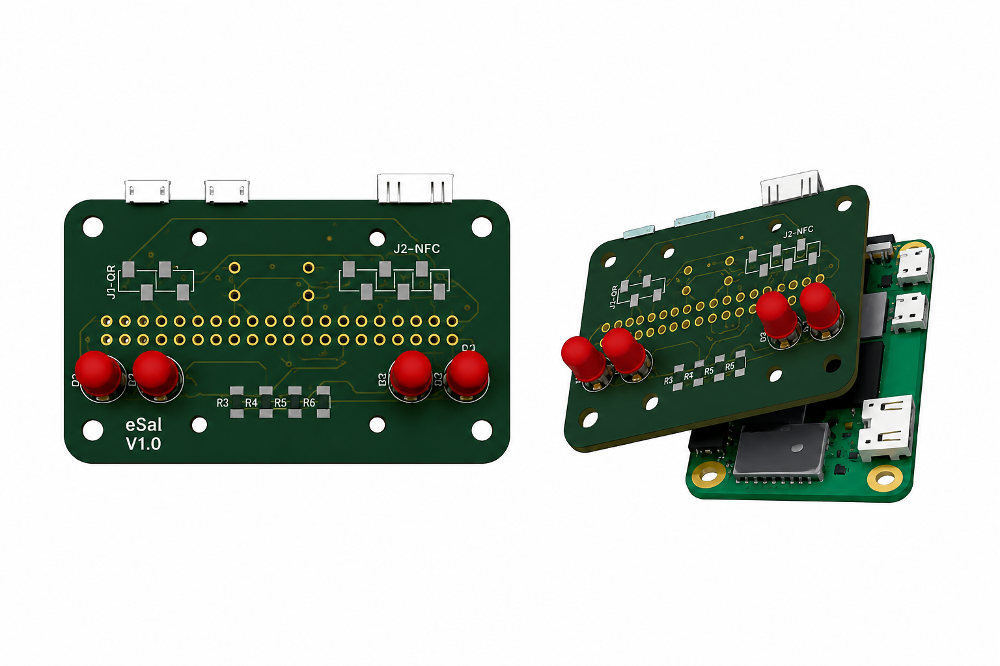

<div align="center">



# eSal (إيصال)

### The first Centralized Receipts system in Saudi Arabia

Built for the **AMAD Hackathon 2026**, sponsored by **Alinma Bank** and **Tuwaiq Academy**

[](#-about-amad-hackathon)
[](#-tech-stack)
[](#-tech-stack)
[](#-hardware)
[](#-license)

**[🇬🇧 English](#-overview)** · **[🇸🇦 النسخة العربية](#-نظرة-عامة)**

</div>

---

## 📑 Table of Contents

- [Overview](#-overview)
- [How It Works](#-how-it-works)
- [System Architecture](#-system-architecture)
- [Hardware](#-hardware)
  - [PCB — eSal HAT V1.0](#pcb--esal-hat-v10)
  - [3D-Printed Enclosure](#3d-printed-enclosure)
- [Tech Stack](#-tech-stack)
- [Repository Structure](#-repository-structure)
- [Getting Started](#-getting-started)
- [About AMAD Hackathon](#-about-amad-hackathon)
- [Roadmap](#-roadmap)
- [License](#-license)
- **[النسخة العربية (Arabic Version) →](#-نظرة-عامة)**

---

## 🟢 Overview

**eSal** ("إيصال" — Arabic for *flowed / streamed*, also styled as *Smart Receipt*) is a centralized receipt-management platform that intercepts printed POS receipts at the point of sale, digitizes them instantly, and delivers structured, AI-categorized spending insights straight to the customer's phone — no app-hunting, no paper, no manual entry.

A small hardware "puck" sits inline with the merchant's existing receipt printer. The moment a receipt is printed, eSal captures it, matches it to the customer (via an NFC tap or a QR scan), and pushes a clean digital record to their iOS app and Apple Wallet — while the backend builds a running picture of the customer's spending habits.

**Why it matters:** Saudi Arabia has no unified, real-time layer for consumer receipts today. eSal aims to be that layer — one puck, any POS printer, instant digital receipts.

---

## ⚙️ How It Works

1. **Interception** — The eSal puck (Raspberry Pi Zero 2W) sits between the POS system and the receipt printer, listening on TCP port `9100` for standard ESC/POS print jobs.
2. **Capture & Parse** — Incoming print data is parsed into structured line items, totals, and merchant metadata.
3. **Customer Identification** — The customer identifies themselves at checkout with an **NFC tap** (via the onboard PN532) or a **QR scan** (via the GM65 module).
4. **Upload** — The parsed receipt is uploaded to the **NestJS** backend and persisted through **Prisma**.
5. **Insights** — The backend generates AI-categorized spending insights (by category, store, budget) and surfaces them in the **SwiftUI** iOS app.
6. **Wallet** — A digital pass is generated and pushed straight to **Apple Wallet** for quick access.
7. **Pairing** — First-boot pairing between a puck and a user is handled through an NFC tag (NTAG215) written with an NDEF URI record that resolves as a Universal Link into the iOS app.

---

## 🏗 System Architecture



---

## 🔩 Hardware

eSal runs on a custom HAT (Hardware Attached on Top) for the Raspberry Pi Zero 2W, housed in a purpose-built circular enclosure.

### PCB — eSal HAT V1.0

<div align="center">

</div>

Designed end-to-end in **KiCad**, going through the full schematic → layout → fabrication workflow.

| Component | Interface | Notes |
|---|---|---|
| PN532 NFC module | I²C (GPIO 2/3) | Reads customer taps, writes the pairing tag on first boot |
| GM65 QR scanner | UART (GPIO 14/15) | Reads customer QR codes at checkout |
| 4× 5 mm THT LEDs | GPIO | 2 red / 2 green, 220 Ω, behind a frosted diffuser insert for status feedback |
| JST connectors | — | Used for all module connections for clean, serviceable wiring |

The board is D-shaped, purpose-fit to the ~112 mm circular puck enclosure.

### 3D-Printed Enclosure

Designed in **Fusion 360** from the KiCad board, exported as STEP and linked into a live component workflow so the enclosure updates with the PCB.

The puck splits into three printable parts — click any file below on GitHub to preview it directly in the browser's 3D viewer:

| Part | File |
|---|---|
| Top lid | [`hardware/enclosure/top_lid.stl`](hardware/enclosure/top_lid.stl) |
| Main body | [`hardware/enclosure/main_body.stl`](hardware/enclosure/main_body.stl) |
| Bottom lid | [`hardware/enclosure/bottom_lid.stl`](hardware/enclosure/bottom_lid.stl) |

> 💡 GitHub natively renders `.stl` files with an interactive 3D viewer — no extra tooling needed, just open the file in the repo.

---

## 🛠 Tech Stack

| Layer | Technology |
|---|---|
| Backend | [NestJS](https://nestjs.com/) (TypeScript) |
| ORM / Database | [Prisma](https://www.prisma.io/) + PostgreSQL |
| Mobile App | SwiftUI (iOS) |
| Wallet Integration | `passkit-generator` (Apple Wallet `storeCard` passes) |
| Edge Device | Raspberry Pi Zero 2W |
| NFC | PN532 (I²C) |
| QR | GM65 (UART) |
| PCB Design | KiCad |
| Enclosure Design | Fusion 360 |
| Package Manager | pnpm |

---

## 📁 Repository Structure

```
eSal/
├── backend/              # NestJS backend
│   ├── prisma/           # Prisma schema & migrations (User, Store, Device,
│   │                     # Receipt, LineItem, Category, Budget, Insight, ChatMessage)
│   ├── src/              # NestJS application source
│   ├── test/             # Unit & e2e tests
│   ├── package.json
│   ├── pnpm-workspace.yaml
│   └── prisma.config.ts
├── ios/                  # SwiftUI iOS app
├── pi/                   # Raspberry Pi puck source (NFC/QR pairing, receipt listener)
├── hardware/
│   └── enclosure/        # 3D-printable case (top lid, main body, bottom lid)
├── assets/               # README media (banner, renders)
├── docs/                 # Swift integration reference docs
└── README.md
```

---

## 🚀 Getting Started

```bash
# 1. Clone the repository
git clone https://github.com/MonerMo/eSal.git
cd eSal

# 2. Install dependencies
pnpm install

# 3. Configure environment variables
cp .env.example .env    # then fill in your database URL, etc.

# 4. Generate the Prisma client & run migrations
pnpm prisma generate
pnpm prisma migrate dev

# 5. Run the backend in development mode
pnpm run start:dev
```

The backend listens for standard NestJS routes on its configured port, and the receipt-intercept listener runs separately on **TCP port 9100**, mimicking a standard ESC/POS printer so it can be dropped into an existing POS setup with no merchant-side changes.

---

## 🏆 About AMAD Hackathon

eSal is being built for the **AMAD Hackathon 2026**, sponsored by **Alinma Bank** and **Tuwaiq Academy** — a national fintech hackathon focused on innovative financial solutions for the Saudi market.

---

## 📄 License

This project is released under the [MIT License](LICENSE).

---
---

<div align="center" dir="rtl">

<a name="-نظرة-عامة"></a>

# eSal (إيصال)

### أول نظام مركزي للفواتير في المملكة العربية السعودية

مبني لمشاركة **هاكاثون أماد 2026**، برعاية **بنك الإنماء** و **أكاديمية تويق**

**[⬆ English Version](#-overview)**

</div>

---

<div dir="rtl">

## 📑 جدول المحتويات

- [نظرة عامة](#-نظرة-عامة)
- [آلية العمل](#-آلية-العمل)
- [معمارية النظام](#-معمارية-النظام)
- [العتاد (Hardware)](#-العتاد-hardware)
- [التقنيات المستخدمة](#-التقنيات-المستخدمة)
- [هيكل المستودع](#-هيكل-المستودع)
- [البدء السريع](#-البدء-السريع)
- [عن هاكاثون أماد](#-عن-هاكاثون-أماد)

---

## 🟢 نظرة عامة

**eSal** ("سَال" — وتُعرف أيضًا باسم *Smart Receipt*) هي منصّة مركزية لإدارة الفواتير، تعترض فواتير نقاط البيع المطبوعة لحظة صدورها، وتحوّلها فورًا إلى نسخة رقمية منظّمة، ثم ترسل للعميل رؤى ذكية عن إنفاقه مباشرة على هاتفه — دون البحث عن تطبيقات، ودون أوراق، ودون إدخال يدوي.

جهاز صغير على شكل قرص ("Puck") يوضع في مسار طابعة الفواتير الحالية لدى التاجر. فور طباعة الفاتورة، يلتقطها eSal، ويربطها بهوية العميل (عبر لمسة NFC أو مسح رمز QR)، ثم يرسل نسخة رقمية نظيفة إلى تطبيق iOS الخاص بالعميل وإلى Apple Wallet — بينما يبني الخادم في الخلفية صورة متكاملة عن عادات إنفاق العميل.

**لماذا هذا مهم:** لا توجد اليوم في المملكة طبقة موحّدة وفورية لفواتير المستهلكين. يهدف eSal لأن يكون تلك الطبقة — قرص واحد، يعمل مع أي طابعة نقاط بيع، وفاتورة رقمية فورية.

## ⚙️ آلية العمل

1. **الاعتراض** — يوضع قرص eSal (Raspberry Pi Zero 2W) بين نظام نقطة البيع وطابعة الفواتير، وينصت على المنفذ `9100` لاستقبال بيانات الطباعة بمعيار ESC/POS.
2. **الالتقاط والتحليل** — تُحلَّل بيانات الطباعة الواردة إلى بنود، وإجماليات، وبيانات التاجر.
3. **تحديد هوية العميل** — يعرّف العميل نفسه عند الدفع عبر **لمسة NFC** (وحدة PN532) أو **مسح رمز QR** (وحدة GM65).
4. **الرفع** — تُرفع الفاتورة المُحلَّلة إلى خادم **NestJS** وتُحفظ عبر **Prisma**.
5. **الرؤى الذكية** — يولّد الخادم رؤى إنفاق مصنّفة بالذكاء الاصطناعي (حسب الفئة، المتجر، الميزانية) ويعرضها في تطبيق **SwiftUI**.
6. **المحفظة** — تُنشأ بطاقة رقمية وتُرسل مباشرة إلى **Apple Wallet** للوصول السريع.
7. **الإقران** — يتم إقران القرص بالمستخدم عند أول تشغيل عبر بطاقة NFC (NTAG215) تحتوي سجل NDEF URI يعمل كرابط عالمي (Universal Link) يفتح تطبيق iOS مباشرة.

## 🏗 معمارية النظام

النظام مكوّن من ثلاث طبقات رئيسية: **قرص eSal** (Raspberry Pi Zero 2W) لالتقاط الفواتير وتحديد هوية العميل، **خادم NestJS** مع Prisma لمعالجة البيانات وتوليد الرؤى وبطاقات Apple Wallet، و**تطبيق iOS** لعرض الفواتير والرؤى واستقبال روابط الإقران. راجع مخطط المعمارية في النسخة الإنجليزية أعلاه لتفاصيل تدفق البيانات الكاملة.

## 🔩 العتاد (Hardware)

<div align="center">

</div>

تعمل eSal على لوحة إلكترونية مخصّصة (HAT) لجهاز Raspberry Pi Zero 2W، مصمّمة بالكامل على برنامج **KiCad**، ومحفوظة داخل علبة دائرية مطبوعة بتقنية الطباعة ثلاثية الأبعاد صُمّمت على **Fusion 360**.

تتكوّن العلبة من ثلاثة أجزاء قابلة للطباعة، ويمكن معاينتها مباشرة داخل مستعرض GitHub ثلاثي الأبعاد:

- [`hardware/enclosure/top_lid.stl`](hardware/enclosure/top_lid.stl) — الغطاء العلوي
- [`hardware/enclosure/main_body.stl`](hardware/enclosure/main_body.stl) — الجسم الرئيسي
- [`hardware/enclosure/bottom_lid.stl`](hardware/enclosure/bottom_lid.stl) — الغطاء السفلي

## 🛠 التقنيات المستخدمة

الخادم مبني على **NestJS**، مع **Prisma** كطبقة ORM لقاعدة بيانات PostgreSQL. تطبيق الجوال مبني بـ **SwiftUI**. القرص الطرفي يعتمد على **Raspberry Pi Zero 2W** مع وحدة **PN532** لتقنية NFC عبر I²C، ووحدة **GM65** لقراءة رموز QR عبر UART. تصميم اللوحة تم على **KiCad**، وتصميم العلبة على **Fusion 360**.

## 📁 هيكل المستودع

يحتوي المستودع على مجلد `backend/` وبداخله مجلد `prisma/` لمخطط قاعدة البيانات والترحيلات، ومجلد `src/` لكود خادم NestJS، ومجلد `test/` للاختبارات، بالإضافة إلى مجلد `ios/` لتطبيق SwiftUI، ومجلد `pi/` لكود جهاز Raspberry Pi، ومجلد `hardware/enclosure/` لملفات العلبة ثلاثية الأبعاد، ومجلد `assets/` لصور ملف README، ومجلد `docs/` لوثائق ربط تطبيق iOS.

## 🚀 البدء السريع

```bash
git clone https://github.com/MonerMo/eSal.git
cd eSal
pnpm install
cp .env.example .env
pnpm prisma generate
pnpm prisma migrate dev
pnpm run start:dev
```

## 🏆 عن هاكاثون أماد

يُبنى مشروع eSal للمشاركة في **هاكاثون أماد 2026**، برعاية **بنك الإنماء** و**أكاديمية تويق** — وهو هاكاثون وطني في مجال التقنية المالية يركّز على الحلول المبتكرة للسوق السعودي.

</div>

<div align="center">

**[⬆ Back to top / العودة للأعلى](#esal-سَال)**

</div>
