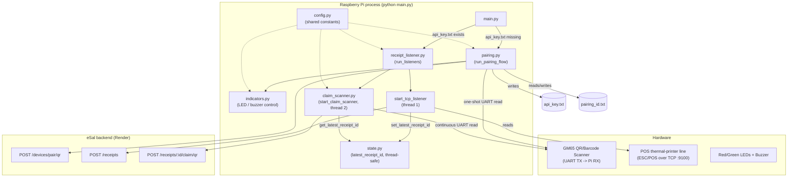

# eSal Raspberry Pi Device — Architecture & File Reference

This document describes the Raspberry Pi Zero 2W codebase that runs on each physical
eSal device. The device sits inline between a shop's POS system and its thermal
printer, captures the raw receipt data, forwards it to the eSal backend, and lets a
customer claim that receipt to their account by scanning their Apple Wallet QR code.

## Architecture diagram

## Threading model at a glance

The process has exactly one entry point (`main.py`) and, once past pairing, two
long-lived daemon threads that run for the rest of the process's life:

1. **TCP thread** (`start_tcp_listener`) — waits for POS connections on port 9100.
2. **Claim thread** (`start_claim_scanner`) — waits for customer QR scans on UART.

They never call each other directly. The only thing that crosses the thread
boundary is a single value — "the most recently created receipt's id" — passed
through `state.py`. `run_listeners()` starts both threads and then blocks the main
thread on `tcp_thread.join()`; since neither thread ever returns, this keeps the
process alive indefinitely, and because both threads are `daemon=True`, a
`Ctrl+C` cleanly kills everything with no explicit shutdown logic needed.

Pairing (UART) and claim-scanning (also UART) never run at the same time, so
there's no contention over the serial port — pairing fully completes (or fails)
before `run_listeners()` is ever called.

---

## File-by-file reference

### `config.py`

Single source of truth for constants used across every other module. No
functions — just top-level values, so changing the backend URL, a GPIO pin, or
the UART baud rate is a one-line edit instead of a hunt-and-replace.

| Constant | Purpose |
|---|---|
| `BACKEND_URL` | Base URL of the deployed Render backend; every HTTP call prefixes this. |
| `PAIRING_ID_FILE` | Local file caching the device's persistent `pairingId` (a UUID) across reboots/retries. |
| `API_KEY_FILE` | Local file storing the device's API key once pairing succeeds. Its mere *existence* is what `main.py` checks to decide "am I already paired?" |
| `UART_PORT`, `UART_BAUD` | Serial port/baud for the GM65 scanner — shared by both the one-shot read in `pairing.py` and the continuous read in `claim_scanner.py`. |
| `RED_LED_PIN`, `GREEN_LED_PIN`, `BUZZER_PIN` | GPIO (BCM) pin numbers wired to the two status LEDs and the active buzzer. |

### `state.py`

The only piece of runtime state shared across the thread boundary between the
TCP listener and the claim scanner. Deliberately minimal — a single value behind
a lock, nothing more.

- **`set_latest_receipt_id(receipt_id)`** — acquires `_lock`, overwrites the
  module-level `_latest_receipt_id`. Called once, from
  `receipt_listener.send_receipt()`, right after a receipt is successfully
  created on the backend.
- **`get_latest_receipt_id()`** — acquires `_lock`, returns the current value.
  Called from `claim_scanner.claim_receipt()` every time a QR scan comes in, to
  know which receipt to attach the claim to.

Why the module works as *shared* storage at all: Python caches an imported
module the first time it's loaded (`sys.modules`), so every file that does
`from state import ...` is looking at the exact same `_latest_receipt_id`
variable in memory, not a copy of it.

Why the lock exists even though a single assignment is already atomic under
CPython's GIL: it documents intent (anyone reading `with _lock:` knows this is
cross-thread state without having to reason about GIL guarantees), and it
future-proofs the module — if this ever grows into tracking more than one
value (e.g. a short history of recent receipts), that becomes a
read-modify-write sequence that genuinely needs the lock.

### `indicators.py`

Wraps the physical LEDs/buzzer behind small, named objects/functions so
`pairing.py` doesn't need to know GPIO details directly.

- **`red_led`, `green_led`** — `gpiozero.LED` objects bound to the pins from `config.py`.
- **`buzzer`** — `gpiozero.Buzzer`, an *active* buzzer (on/off only, no pitch control).
- **`play_success_sound()`** — turns the buzzer on, sleeps 0.7s, turns it off. A
  fixed-duration confirmation beep, currently used only at the end of a
  successful pairing.

> **Note:** `indicators.py` is only consumed by `pairing.py` right now. Nothing
> in `claim_scanner.py` calls it, so a customer scanning their claim QR gets no
> LED/buzzer feedback — success or failure only shows up in the terminal. Worth
> deciding later whether claim scans should also flash/beep.

### `pairing.py`

The one-time flow (runs once per fresh device, or after `api_key.txt` is
deleted) that links this physical device to a user's account: the GM65 scans
the user's Apple Wallet QR (which encodes their `walletToken`), and the backend
exchanges it for a device-specific API key.

- **`get_or_create_pairing_id()`** — if `pairing_id.txt` already exists, returns
  its contents (so retrying a failed pairing attempt reuses the same
  `pairingId` instead of minting a new one each time). Otherwise generates a
  new `uuid.uuid4()`, writes it to `pairing_id.txt`, and returns it. This id is
  what ties the device to a pairing session on the backend *before* the device
  has an API key of its own.
- **`wait_for_qr_scan()`** — opens the UART port and blocks until a full,
  non-empty line comes through, then returns it as the scanned `wallet_token`.
  This is a **one-shot** wait — it returns as soon as a single scan arrives,
  unlike `claim_scanner.start_claim_scanner()`, which loops forever.
- **`pair_device(pairing_id, wallet_token)`** — `POST`s
  `{pairingId, walletToken}` to `/devices/pair/qr`, raises on a non-2xx via
  `raise_for_status()`, and returns the parsed JSON (which contains the new
  `apiKey`).
- **`run_pairing_flow()`** — the orchestrator: gets/creates the `pairingId`,
  blinks the red LED to signal "waiting for a scan," blocks on
  `wait_for_qr_scan()`, turns the red LED off, then calls `pair_device()`. On
  failure: prints the error, fast-blinks the red LED, returns `False` (telling
  `main.py` not to proceed to listening). On success: writes the `apiKey` to
  `api_key.txt`, turns the green LED on, plays the success buzzer sound, and
  returns `True`.

### `receipt_listener.py`

The always-on "capture what the POS prints" responsibility, plus the entry
point that also starts the claim-scanning responsibility as a concurrent
thread.

- **`get_api_key()`** — reads and returns the persisted API key from
  `api_key.txt`. Re-read from disk on every call (not cached in a variable) so
  that if the key file is ever rewritten while the process is running, the
  very next request automatically picks up the new value.
- **`send_receipt(raw_bytes)`** — decodes the raw captured bytes as **latin-1**
  (chosen deliberately: every byte value 0–255 maps to exactly one character,
  so arbitrary binary ESC/POS data survives losslessly with zero decode
  errors — unlike UTF-8, which can throw on binary data). `POST`s it as
  `{"rawData": ...}` to `/receipts` with the device's API key header. On
  success, pulls the new receipt's `id` out of the JSON response and hands it
  to `state.set_latest_receipt_id()` — this is the one link between the TCP
  side and the claim side. Any exception is caught and printed rather than
  propagated, so one bad receipt doesn't kill the listening loop.
- **`start_tcp_listener()`** — opens a TCP socket, binds `0.0.0.0:9100` (the
  standard ESC/POS printer port, which is why the Pi can sit inline as if it
  *were* the printer), and loops forever: accept a connection, read chunks via
  `recv(4096)` until the peer closes it (an empty `recv` = EOF — this is how
  "one receipt = one connection" framing is detected, with no explicit
  end-of-receipt marker needed), then hand any collected data to
  `send_receipt()`.
- **`run_listeners()`** — starts `start_tcp_listener()` in its own daemon
  thread, and (via `from claim_scanner import start_claim_scanner` placed
  *inside* the function rather than at module level — done specifically to
  avoid a circular import, since `claim_scanner.py` itself imports
  `get_api_key` from this file) also starts `start_claim_scanner()` in a second
  daemon thread. Then blocks the main thread on `tcp_thread.join()`. The
  commented-out `#future: usb_thread ...` lines mark exactly where a third,
  USB-gadget-mode listener would plug in later without needing to restructure
  anything else here.

### `claim_scanner.py`

The second always-on responsibility: continuously watching the same physical
GM65 scanner (repurposed, once pairing is done, to watch for *customer* wallet
QR scans) and attaching whichever receipt was most recently created to
whichever customer just scanned.

- **`claim_receipt(wallet_token)`** — looks up
  `state.get_latest_receipt_id()`; if there isn't one yet (e.g. someone scans
  before any receipt has been created this session), prints a message and
  bails out rather than sending a nonsensical request. Otherwise `POST`s
  `{"walletToken": wallet_token}` to `/receipts/{receipt_id}/claim/qr`. On
  success, prints a confirmation. On an HTTP error, it specifically catches
  `requests.exceptions.HTTPError` and pulls the real message out of the
  backend's JSON error body (falling back to the raw response text if the body
  isn't JSON) — this is what surfaces backend messages like *"Only customer
  accounts can claim receipts"* or *"Receipt has already been claimed"*
  instead of a generic `404 Client Error`. A broader `except Exception` catches
  anything else (network failure, timeout).
- **`start_claim_scanner()`** — opens the UART port (same port/baud as
  `pairing.py`'s one-shot version) and loops **forever**: read a line, skip if
  empty, decode it as a `wallet_token`, and if non-empty, hand it to
  `claim_receipt()`. Unlike `pairing.wait_for_qr_scan()`, this never returns —
  it's built to run for the entire lifetime of the process, handling as many
  scans as occur.

### `main.py`

The single entry point tying pairing and listening together based on whether
this device has already been paired.

- **`main()`** — checks whether `api_key.txt` exists. If not, this device has
  never successfully paired, so it calls `run_pairing_flow()`; if that returns
  `False`, `main()` returns immediately without ever starting the listeners (a
  device with no API key can't authenticate to `/receipts` anyway). If
  `api_key.txt` already exists — either because pairing just succeeded, or
  because it was already paired from a previous run — `main()` calls
  `run_listeners()`, which never returns, keeping the process alive with both
  threads running.
- **`if __name__ == "__main__": main()`** — standard entry-point guard.

---

## Known gaps / deliberately deferred work

- **No physical feedback for claim scans.** `indicators.py` exists but isn't
  wired into `claim_scanner.py` — a customer only sees terminal output, not an
  LED/beep, for a successful or failed claim.
- **"Latest receipt" model assumes one POS, one transaction at a time.** This
  matches the current single-device-per-POS setup; it would need rethinking
  (e.g. matching by a time window instead of "most recent") if a device ever
  had to handle multiple concurrent transactions.
- **GM65 may fire more than one UART line per physical scan** — observed
  empirically during testing. Not yet deduplicated; harmless today since
  re-claiming an already-`ASSIGNED` receipt is now rejected by the backend, but
  worth knowing if you see duplicate log lines for a single scan.
- **USB gadget-mode listener** (parallel to the TCP listener, for POS units
  connected via USB instead of network) — structurally anticipated (see the
  `#future:` comment in `run_listeners()`) but not built.
- **NFC-based device pairing and receipt claiming** (PN532 module) — planned
  as a second, concurrent path alongside the existing QR flow for both pairing
  and claiming, not yet built. See the architecture discussion for how the two
  paths will differ: QR-claiming is Pi-initiated (the Pi makes the backend
  call), NFC-claiming will be phone-app-initiated (the phone's app calls the
  backend directly after tapping the NFC tag; the Pi's only job there will be
  keeping the tag's broadcast content in sync with `state.py`).
